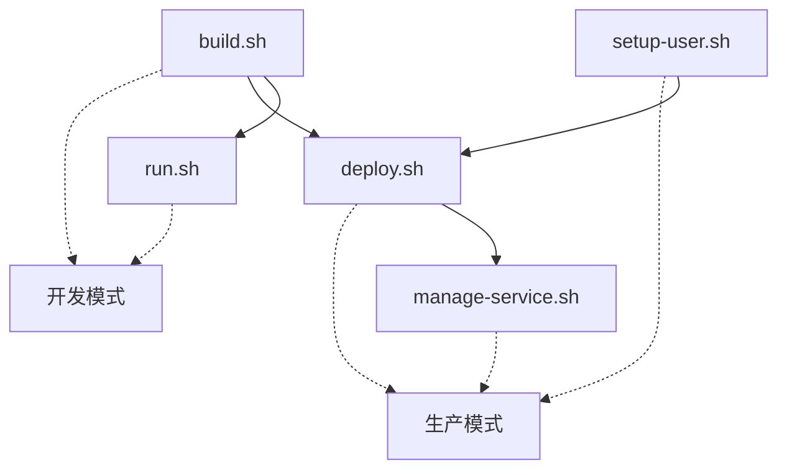

# 📁 Analytics Engine 脚本目录

> **构建和部署脚本的技术文档**  
> 完整的部署流程请参考：[DEPLOYMENT_GUIDE.md](DEPLOYMENT_GUIDE.md)

## 🎯 脚本概览

| 脚本 | 用途 | 运行频率 | 权限要求 |
|------|------|----------|----------|
| `build.sh` | 构建Rust二进制文件 | 开发时 | 普通用户 |
| `run.sh` | 开发模式运行服务 | 开发时 | 普通用户 |
| `setup-user.sh` | 创建analytics专用用户 | 一次性 | sudo |
| `deploy.sh` | 生产部署和配置 | 部署时 | analytics用户 |
| `manage-service.sh` | 服务运维管理 | 日常运维 | sudo |

## 📋 脚本技术文档

### build.sh - 构建脚本
**用途**: 编译Rust代码，生成analytics-server二进制文件

**环境变量**:
```bash
BUILD_MODE=debug          # debug|release (默认: release)
FEATURES=python-bridge    # python-bridge|rust-only (默认: python-bridge)
SKIP_TESTS=false         # true|false (默认: false)
RUST_LOG=info            # error|warn|info|debug|trace
```

**使用示例**:
```bash
# 基本构建
./scripts/build.sh

# 调试构建
BUILD_MODE=debug ./scripts/build.sh

# 仅Rust功能
FEATURES=rust-only ./scripts/build.sh

# 跳过测试加速构建
SKIP_TESTS=true ./scripts/build.sh
```

**输出**: `target/release/analytics-server` (约10MB静态二进制)

---

### run.sh - 开发运行脚本
**用途**: 直接运行服务，适合开发调试

**环境变量**:
```bash
ANALYTICS_LISTEN_ADDR=127.0.0.1:50051    # 监听地址
ANALYTICS_SOCKET_PATH=/tmp/analytics.sock # Unix Socket路径
RUST_LOG=info                             # 日志级别
PYTHONPATH=./python                       # Python模块路径
```

**使用示例**:
```bash
# 默认运行（localhost:50051）
./scripts/run.sh

# 允许外部访问
ANALYTICS_LISTEN_ADDR=0.0.0.0:50051 ./scripts/run.sh

# Unix Socket模式
ANALYTICS_SOCKET_PATH=/tmp/analytics.sock ./scripts/run.sh

# 详细调试日志
RUST_LOG=debug ./scripts/run.sh
```

**特点**:
- ✅ 无需root权限
- ✅ 前台运行，便于调试
- ✅ 实时代码重载支持
- ❌ 重启后不会自动启动

---

### setup-user.sh - 用户设置脚本
**用途**: 创建analytics专用用户和相关目录

**命令参数**:
```bash
sudo ./scripts/setup-user.sh [OPTIONS]

选项:
  -p, --password      设置用户密码（交互式输入）
  -s, --sudo          配置sudo权限
  -k, --ssh-keys      生成SSH密钥对
  -u, --uid UID       指定用户UID（默认: 2001）
  -g, --gid GID       指定用户GID（默认: 2001）
  -h, --help          显示帮助信息
```

**使用示例**:
```bash
# 基础用户创建
sudo ./scripts/setup-user.sh

# 完整配置（密码+sudo+SSH）
sudo ./scripts/setup-user.sh -p -s -k

# 自定义UID/GID
sudo ./scripts/setup-user.sh -u 3001 -g 3001
```

**执行结果**:
- 创建analytics用户 (默认UID: 2001, GID: 2001)
- 创建目录: `/opt/v7/analytics-engine/`
- 设置目录权限: `755 (analytics:analytics)`
- 可选：配置密码、sudo权限、SSH密钥

---

### deploy.sh - 统一部署脚本
**用途**: 生产环境部署，支持本地和远程

**命令参数**:
```bash
./scripts/deploy.sh [OPTIONS]

选项:
  --enable-remote                    本地部署+开放远程访问
  --remote-host HOSTNAME            远程服务器部署
  --ssh-user USER                   SSH用户名（默认: root）
  --ssh-port PORT                   SSH端口（默认: 22）
  --target-dir DIR                  目标目录（默认: /opt/v7/analytics-engine）
  --listen-addr ADDR                监听地址（默认: 127.0.0.1:50051）
  --skip-firewall                   跳过防火墙配置
  --dry-run                         模拟执行，不实际部署
  -h, --help                        显示帮助信息
```

**使用示例**:
```bash
# 本地部署（仅localhost访问）
sudo -u analytics ./scripts/deploy.sh

# 本地部署+远程访问
sudo -u analytics ./scripts/deploy.sh --enable-remote

# 远程服务器部署
./scripts/deploy.sh --remote-host 192.168.1.100

# 自定义SSH配置
./scripts/deploy.sh --remote-host 192.168.1.100 --ssh-user ubuntu --ssh-port 2222

# 自定义监听地址
sudo -u analytics ./scripts/deploy.sh --listen-addr 0.0.0.0:8051

# 模拟执行
./scripts/deploy.sh --remote-host 192.168.1.100 --dry-run
```

**执行流程**:
1. 🔄 停止现有服务
2. 📦 备份当前版本
3. 🚀 部署新二进制文件
4. ⚙️ 创建/更新systemd服务
5. 🔥 配置防火墙（可选）
6. ✅ 启动并验证服务

---

### manage-service.sh - 服务管理脚本
**用途**: 日常运维和服务管理

**命令参数**:
```bash
./scripts/manage-service.sh [COMMAND]

命令:
  start                 启动服务
  stop                  停止服务  
  restart               重启服务
  status                查看状态
  health                健康检查
  logs [live]           查看日志（可选实时）
  enable                开机自启
  disable               禁用自启
  reload                重载服务配置
  help                  显示帮助
```

**使用示例**:
```bash
# 交互式菜单（推荐）
./scripts/manage-service.sh

# 直接命令
./scripts/manage-service.sh start
./scripts/manage-service.sh stop
./scripts/manage-service.sh restart
./scripts/manage-service.sh status
./scripts/manage-service.sh health
./scripts/manage-service.sh logs
./scripts/manage-service.sh logs live
./scripts/manage-service.sh enable
./scripts/manage-service.sh disable
```

**功能特点**:
- 🎛️ 友好的交互式界面
- 📊 实时服务状态显示
- 📝 日志查看和实时跟踪
- 🏥 gRPC健康检查
- ⚡ 开机自启管理
- 🔄 安全的服务重载

## 🔧 脚本关系图



## 🚨 技术注意事项

### 权限模型
```bash
# 开发脚本：普通用户
build.sh, run.sh → 用户权限

# 系统管理：sudo权限
setup-user.sh → sudo
manage-service.sh → sudo (systemctl操作)

# 部署脚本：analytics用户
deploy.sh → analytics用户 (本地)
deploy.sh → SSH访问 (远程)
```

### 环境依赖
```bash
# 必需工具
- cargo (Rust工具链)
- python3 (Python运行时)
- systemctl (systemd管理)
- sudo (权限提升)

# 可选工具  
- grpcurl (健康检查)
- ufw (防火墙管理)
- ssh (远程部署)
```

### 文件布局
```
/opt/v7/analytics-engine/          # 部署目录
├── bin/analytics-server           # 主程序
├── backup/                        # 备份目录
│   └── analytics-server.YYYYMMDD  # 版本备份
└── logs/                          # 日志目录

/etc/systemd/system/               # systemd配置
└── analytics-engine.service      # 服务定义

~/.ssh/                            # SSH配置
├── id_rsa                         # 私钥（远程部署）
└── id_rsa.pub                     # 公钥
```

## 📞 获取帮助

每个脚本都支持`--help`参数：
```bash
./scripts/setup-user.sh --help
./scripts/deploy.sh --help
./scripts/manage-service.sh help
```

或查看完整部署指南：[DEPLOYMENT_GUIDE.md](DEPLOYMENT_GUIDE.md)