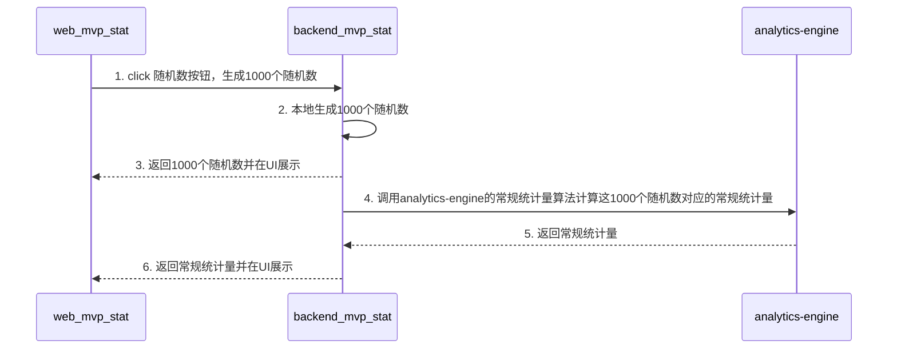
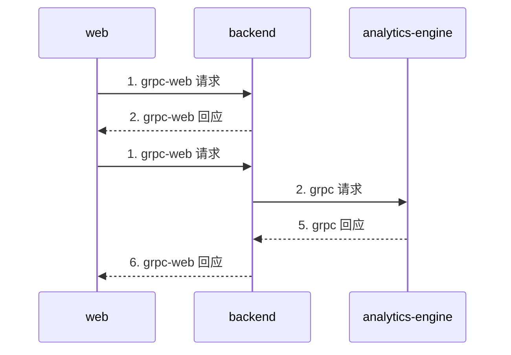

## backend mvp_stat 功能切片交互场景

## web,backend,analytics-engine 通信流程

## 常规统计量：

平均值（Mean）
中位数（Median）
众数（Mode）

极差（Range）
方差（Variance）
标准差（Standard Deviation）
四分位距（IQR）

偏度（Skewness）
峰度（Kurtosis）

总数（Count/N）
总和（Sum）
最小值/最大值（Min/Max）
百分位数（Percentiles）