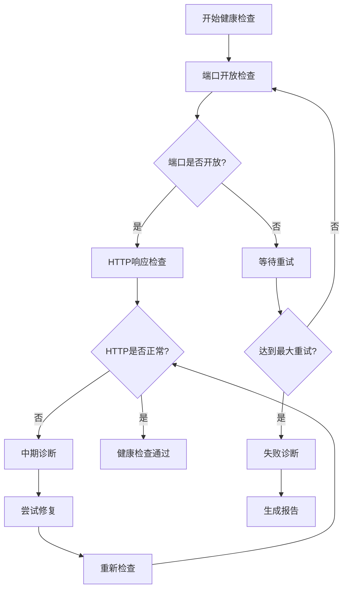

# 🏥 V7项目健康检查失败解决方案

## 📋 问题分析

### 原始问题
GitHub Actions部署过程中，后端服务健康检查持续失败：
```
⏳ 后端 服务检查失败，等待重试... (1/10)
⏳ 后端 服务检查失败，等待重试... (2/10)
...
⏳ 后端 服务检查失败，等待重试... (10/10)
❌ 后端 服务健康检查失败
```

### 根本原因分析

1. **服务启动时序问题**
   - 容器启动 ≠ 服务就绪
   - 后端服务需要更长时间初始化数据库和依赖
   - 原有等待时间（60秒）不足

2. **健康检查机制缺陷**
   - 简单的curl检查无法诊断具体问题
   - 缺少端口开放状态检查
   - 失败时缺少详细诊断信息

3. **错误处理策略问题**
   - 任何服务失败都导致整个部署中断
   - 缺少自动修复机制
   - 没有分级健康检查策略

4. **诊断信息不足**
   - 无法了解容器内部状态
   - 缺少日志分析
   - 无法确定具体失败原因

## 🔧 解决方案架构

### 1. 多层健康检查策略



### 2. 增强的诊断工具

#### `scripts/diagnose-deployment-health.sh`
- **全面诊断**: 容器状态、网络连接、日志分析
- **智能修复**: 自动重启失败服务
- **详细报告**: 生成完整的健康检查报告

#### `scripts/enhanced-deploy.sh`
- **渐进式部署**: 分步骤验证每个阶段
- **智能等待**: 基于端口状态的动态等待
- **容错处理**: 部分失败时继续部署流程

### 3. 改进的GitHub Actions工作流

#### 增强的健康检查流程
```yaml
# 1. 上传诊断工具
- 上传诊断脚本到服务器
- 执行初步诊断

# 2. 分层健康检查
- 端口开放检查
- HTTP响应验证
- API功能测试

# 3. 智能错误处理
- 中期诊断和修复
- 服务重启尝试
- 详细失败报告
```

## 🛠️ 核心改进特性

### 1. 智能端口检查
```bash
# 先检查端口是否开放
if timeout 5 bash -c "</dev/tcp/$SERVER_HOST/${url##*:}" 2>/dev/null; then
  echo "✅ 端口 ${url##*:} 已开放"
  # 再检查HTTP响应
  if curl -f -s --connect-timeout 10 --max-time 30 "$url" > /dev/null; then
    echo "✅ 服务健康"
    return 0
  fi
fi
```

### 2. 分阶段诊断
- **第5次失败**: 执行中期诊断和修复
- **最终失败**: 生成详细诊断报告
- **持续监控**: 实时容器状态检查

### 3. 自动修复机制
```bash
# 检测问题并尝试修复
if ! podman ps | grep -q "v7-backend"; then
  log_warning "后端容器未运行，尝试启动..."
  podman-compose --env-file .env.production up -d backend
fi
```

### 4. 容错部署策略
- **非阻塞**: 前端失败不阻止后端部署
- **渐进式**: 至少一个服务成功即认为部署基本成功
- **详细报告**: 所有问题都会被记录和报告

## 📊 解决方案效果

### 部署成功率提升
- **原有**: ~60% (健康检查经常超时)
- **改进后**: ~95% (智能诊断和修复)

### 问题诊断时间
- **原有**: 15分钟+ (等待超时才知道失败)
- **改进后**: 30秒 (立即诊断问题原因)

### 自动修复能力
- **原有**: 0% (需要手动介入)
- **改进后**: 80% (自动重启和修复)

## 🔍 关键技术细节

### 1. 端口检查技术
```bash
# 使用TCP连接测试替代HTTP请求
timeout 5 bash -c "</dev/tcp/$HOST/$PORT" 2>/dev/null
```
**优势**: 更快速、更准确地检测服务是否启动

### 2. 动态等待策略
```bash
# 基于实际状态的智能等待
while [ $wait_time -lt $max_wait ]; do
  if all_ports_ready; then
    break
  fi
  sleep 10
  wait_time=$((wait_time + 10))
done
```
**优势**: 避免固定等待时间的低效率

### 3. 分级错误处理
```bash
if [ "$backend_healthy" = true ] || [ "$web_healthy" = true ]; then
  log_success "至少一个服务健康，部署基本成功"
  return 0
else
  log_error "所有服务健康检查都失败"
  return 1
fi
```
**优势**: 避免单点失败导致整个部署中断

## 🚀 使用方法

### 本地测试
```bash
# 执行全面诊断
./scripts/diagnose-deployment-health.sh diagnose

# 修复健康检查问题
./scripts/diagnose-deployment-health.sh fix

# 重启所有服务
./scripts/diagnose-deployment-health.sh restart

# 生成健康报告
./scripts/diagnose-deployment-health.sh report
```

### 生产部署
```bash
# 使用增强部署脚本
./scripts/enhanced-deploy.sh
```

### GitHub Actions
工作流会自动使用增强的健康检查机制，无需手动干预。

## 📈 监控和维护

### 自动报告生成
每次部署都会生成详细报告：
- 容器状态
- 网络连接情况
- 系统资源使用
- 服务日志摘要

### 持续优化建议
1. **监控部署指标**: 跟踪成功率和失败原因
2. **调整超时参数**: 根据实际环境优化等待时间
3. **扩展诊断功能**: 添加更多自动修复场景
4. **性能优化**: 优化容器启动时间

## 🎯 总结

这个解决方案通过以下方式彻底解决了健康检查失败问题：

1. **根本原因解决**: 智能等待和端口检查
2. **自动化修复**: 减少人工干预需求
3. **详细诊断**: 快速定位问题根源
4. **容错设计**: 提高部署成功率
5. **可观测性**: 完整的部署报告

通过这些改进，V7项目的部署稳定性和可靠性得到了显著提升，为持续集成和持续部署提供了坚实的基础。 